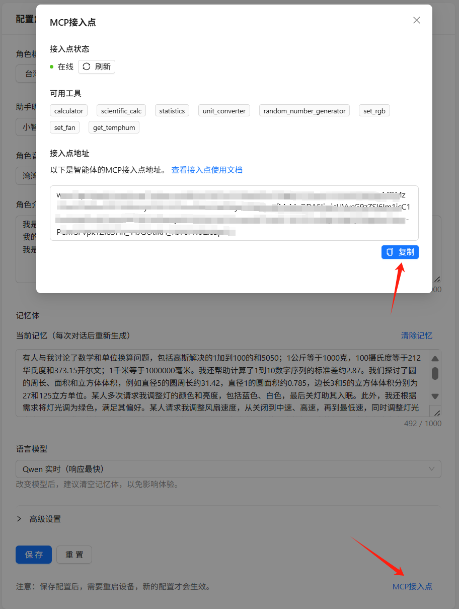
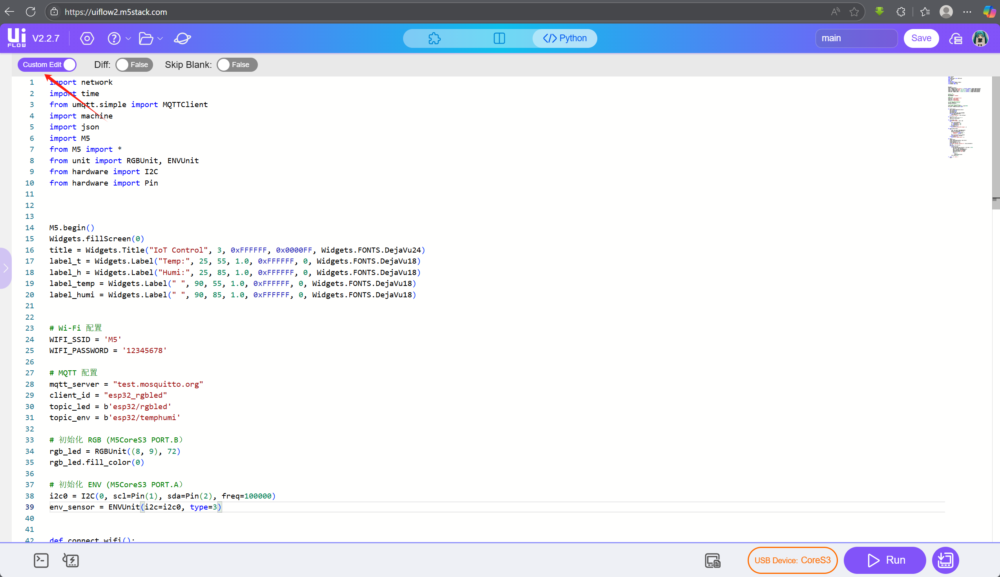
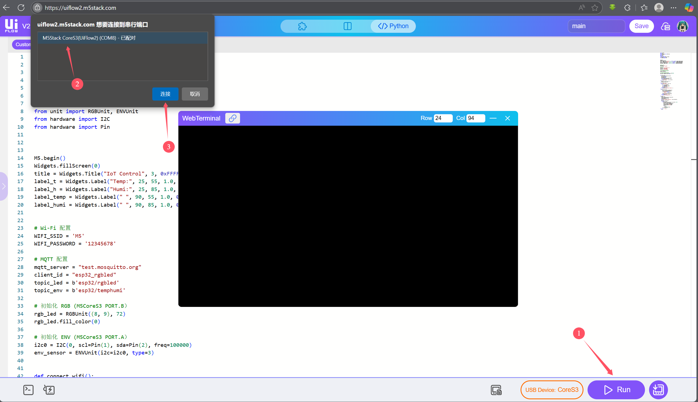
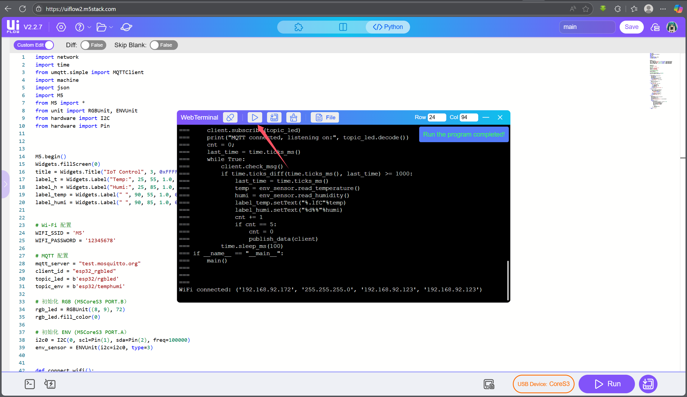

# MCP 控制测试

* [xiaozhi MCP](https://ccnphfhqs21z.feishu.cn/wiki/HiPEwZ37XiitnwktX13cEM5KnSb)

------------------------------------
## 快速开始 

```shell
git clone https://github.com/hlym123/xiaozhi_mcp_examples.git
```

```shell
cd xiaozhi_mcp_examples
pip install -r irequirement
```

### 设置 MCP_ENDPOINT

先获取你设备的 MCP_ENDPOINT，进入 [xiaozhi 控制台](https://xiaozhi.me/console/agents) ，点击配置角色，再点击右下角的 MCP接入点，复制。

<center>

</center>


```shell
export MCP_ENDPOINT=<you_mcp_endpoint>
```

### 运行 MCP 服务 

```shell
python mcp_pipe.py server.py
```

### 命令测试 

```shell
# 发布消息测试
mosquitto_pub -h test.mosquitto.org -t esp32/temphumi -m '{"temperature":24.8,"humidity":55.3}'
```

```shell
# 订阅消息测试
mosquitto_sub -h test.mosquitto.org -t "esp32/rgbled"
```

```shell
# 订阅消息测试
mosquitto_sub -h test.mosquitto.org -t "esp32/fan"
```

唤醒 xiaozhi，语音对话，说 “开灯，关灯，获取温湿度” 等命令测试。

### 硬件测试  

硬件准备：

* [控制器 CoreS3](https://docs.m5stack.com/zh_CN/core/CoreS3)
* [灯带 neopixel](https://docs.m5stack.com/zh_CN/unit/neopixel)
* [温湿度传感器 envIII](https://docs.m5stack.com/zh_CN/unit/envIII)

1. 复制程序 m5_device.py 内容到编辑区

<center>

</center>

2. 连接设备

<center>

</center>

3. 运行程序

<center>

</center>

 